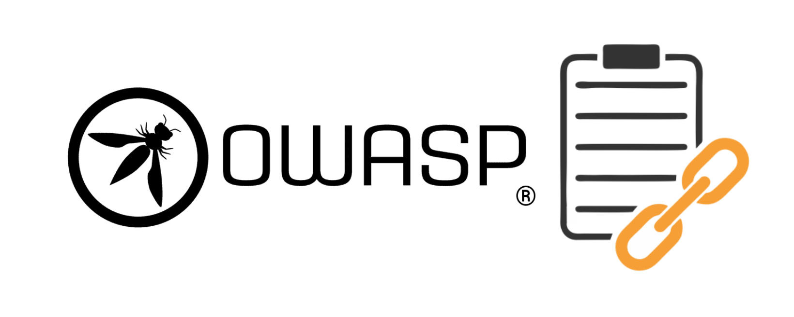
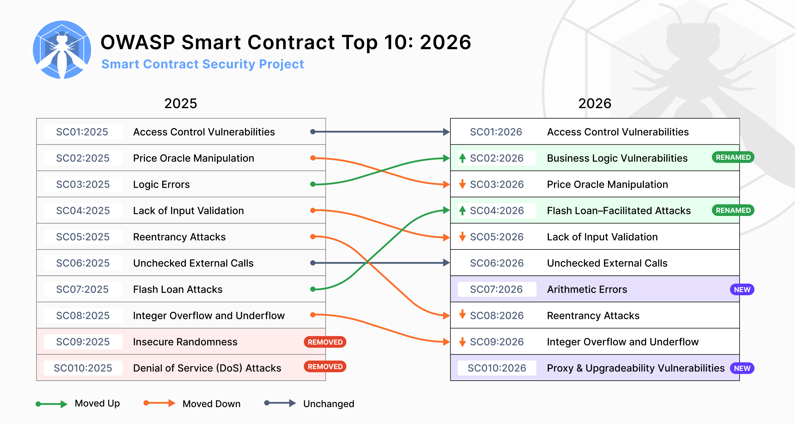
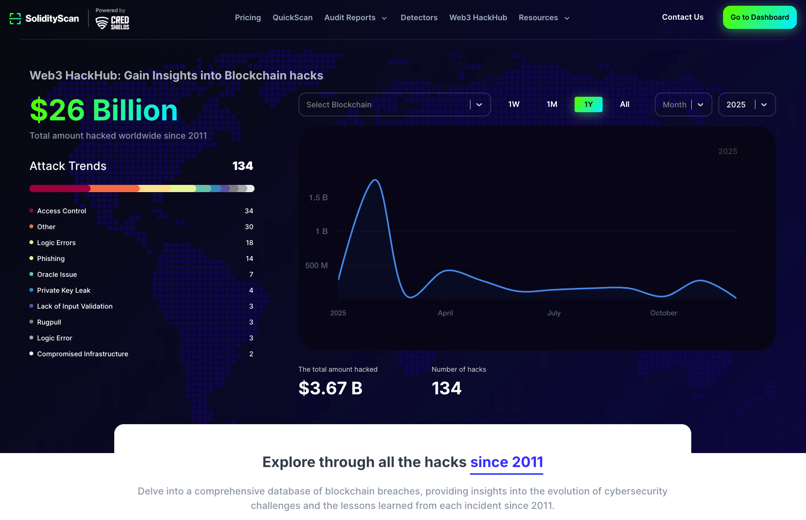

# [OWASP Smart Contract Top 10](https://owasp.org/www-project-smart-contract-top-10/)

> ## Join the OWASP Smart Contract Security Slack
> 
> 
> _Discussions and Support_

-----

## About the Smart Contract Top 10

The **OWASP Smart Contract Top 10: 2026** is a standard awareness document that aims to provide Web3 developers and security teams with insights into the top 10 vulnerabilities found in smart contracts. It is a **sub‑project of the broader [OWASP Smart Contract Security (OWASP SCS) initiative](https://scs.owasp.org/)**.

It serves as a reference to ensure that smart contracts are secured against the most critical weaknesses exploited or discovered in recent years. The **Smart Contract Top 10** can be used alongside other OWASP SCS projects to ensure comprehensive risk coverage:

- **OWASP SC Weakness Enumeration (SCWE): [https://scs.owasp.org/SCWE/](https://scs.owasp.org/SCWE/)**
- **OWASP SCS Checklist: [https://scs.owasp.org/checklists/](https://scs.owasp.org/checklists/)**
- **OWASP SC Top 10 Live Site (2026): [https://scs.owasp.org/sctop10/](https://scs.owasp.org/sctop10/)**

Use the Top 10 for:
- **Awareness**: Understand the most common and critical vulnerabilities affecting smart contracts.
- **Prevention**: Implement best practices to safeguard against these known issues.
- **Standard Compliance**: A reference to ensure secure development and assessment of smart contracts.

> Note: The current **2026** Top 10 is **forward-looking**: its ordering and category definitions are derived from **security incidents and survey data collected during 2025**, and then used to forecast which risks are expected to be most significant in the upcoming year. In other words, 2025 breach and vulnerability data provides the empirical foundation, while the 2026 list reflects how those observations are projected into the near future.  
>  
> This ranking is intended to raise awareness among security researchers, auditors, developers, protocol owners, and the broader industry about the 10 most commonly occurring and impactful smart contract risks.

## Changes (2025-2026)

### 2026 Top 10 (Forward-Looking)

* SC01:2026 - [Access Control Vulnerabilities](2026/en/src/SC01-access-control-vulnerabilities.md)
* SC02:2026 - [Business Logic Vulnerabilities](2026/en/src/SC02-business-logic-vulnerabilities.md)
* SC03:2026 - [Price Oracle Manipulation](2026/en/src/SC03-price-oracle-manipulation.md)
* SC04:2026 - [Flash Loan–Facilitated Attacks](2026/en/src/SC04-flash-loan-facilitated-attacks.md)
* SC05:2026 - [Lack of Input Validation](2026/en/src/SC05-lack-of-input-validation.md)
* SC06:2026 - [Unchecked External Calls](2026/en/src/SC06-unchecked-external-calls.md)
* SC07:2026 - [Arithmetic Errors](2026/en/src/SC07-arithmetic-errors.md)
* SC08:2026 - [Reentrancy Attacks](2026/en/src/SC08-reentrancy-attacks.md)
* SC09:2026 - [Integer Overflow and Underflow](2026/en/src/SC09-integer-overflow-underflow.md)
* SC10:2026 - [Proxy & Upgradeability Vulnerabilities](2026/en/src/SC10-proxy-and-upgradeability-vulnerabilities.md)

### Overview

| Title | Description |
| -- | -- |
| SC01 - Access Control Vulnerabilities | Access control flaws allow unauthorized users or roles to invoke privileged functions or modify critical state, often leading to full protocol compromise when admin, governance, or upgrade paths are exposed. |
| SC02 - Business Logic Vulnerabilities | Design-level flaws in lending, AMM, reward, or governance logic that break intended economic or functional rules, enabling attackers to extract value even when low-level checks appear correct. |
| SC03 - Price Oracle Manipulation | Weak oracles and unsafe price integrations that let attackers skew reference prices, enabling under-collateralized borrowing, unfair liquidations, and mispriced swaps as part of larger exploit chains. |
| SC04 - Flash Loan–Facilitated Attacks | Attacks that use large, uncollateralized flash loans to magnify small bugs (in logic, pricing, or arithmetic) into large drains, by executing complex multi-step sequences in a single transaction. |
| SC05 - Lack of Input Validation | Missing or weak validation of user, admin, or cross-chain inputs that allows unsafe parameters to reach core logic, corrupting state, breaking assumptions, or enabling direct fund loss. |
| SC06 - Unchecked External Calls | Unsafe interactions with external contracts or addresses where failures, reverts, or callbacks are not safely handled, often enabling reentrancy or inconsistent state. |
| SC07 - Arithmetic Errors | Subtle bugs in integer math, scaling, and rounding; especially in share, interest, and AMM calculations; that can be repeatedly exploited to cause precision loss, or siphon value, particularly when paired with flash loans. |
| SC08 - Reentrancy Attacks | Situations where external calls can re-enter vulnerable functions before state is fully updated, allowing repeated withdrawals or state changes from outdated views of contract state. |
| SC09 - Integer Overflow and Underflow | Dangerous arithmetic on platforms or code paths without robust overflow checks, leading to wrapped values, broken invariants, and potential drains of liquidity or mis-accounting. |
| SC10 - Proxy & Upgradeability Vulnerabilities | Misconfigured or weakly governed proxy, initialization, and upgrade mechanisms that let attackers seize control of implementations or reinitialize critical state. |

## Data Sources

### SolidityScan's Web3HackHub:

To identify and validate the OWASP Smart Contract Top 10 vulnerabilities, we incorporated insights from multiple authoritative sources, with a notable focus on **[SolidityScan's Web3HackHub](https://solidityscan.com/web3hackhub?year=2025) (2025)**. This resource provides a comprehensive database of blockchain-related incidents, offering valuable data on attack vectors, financial losses, and trends. 

Web3HackHub documents breaches from 2011 onward, enabling analysis of evolving attack methods, the increasing sophistication of exploits, and lessons learned from each incident.

The complete **methodology, ranking logic, and external data sources** for the 2026 Top 10 are documented on the OWASP SCS site:

- **Methodology & Data for the 2026 Top 10: https://scs.owasp.org/sctop10/data-sources/**

On that page you’ll find:
- How the practitioner survey is designed and how category rankings are aggregated.  
- How 2025 smart‑contract incident data (SolidityScan Web3HackHub, SlowMist, BlockSec, DeFiHackLabs, etc.) is mapped into OWASP categories.  
- Category‑wise loss totals, risk metrics, and the justification for the final ordering.

## Licensing
The OWASP Smart Contract Top 10 (2026) is [licensed](https://github.com/OWASP/www-project-smart-contract-top-10/blob/main/LICENSE.md) under the [CC BY-NC-SA 4.0](https://creativecommons.org/licenses/by-nc-sa/4.0/), the Creative Commons Attribution-ShareAlike 4.0 license. Some rights reserved.

## Project Leaders
- [Jinson Varghese Behanan](mailto:jinson@owasp.org) (Twitter: [@JinsonCyberSec](https://x.com/JinsonCyberSec))
- [Shashank](mailto:shashank@credshields.com) (Twitter: [@cyberboyIndia](https://x.com/cyberboyIndia))
