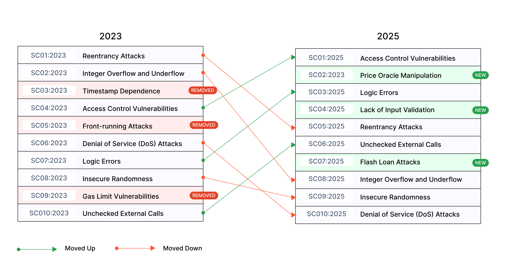
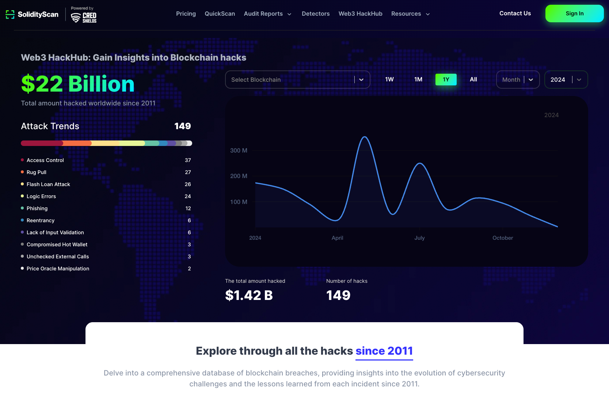

---

layout: col-sidebar
title: OWASP Smart Contract Top 10
tags: smartcontract
level: 2
type: documentation
pitch: Welcome to the OWASP Top Ten for Smart Contracts

---

## About the Smart Contract Top 10

The OWASP Smart Contract Top 10 (2025) is a standard awareness document providing Web3 developers and security teams with insights into the top 10 vulnerabilities found in smart contracts.

It serves as a reference to ensure that smart contracts are secured against the most critical weaknesses exploited or discovered in recent years. The **Smart Contract Top 10** can be used alongside other smart contract security projects to ensure comprehensive risk coverage. Visit [scs.owasp.org](https://scs.owasp.org/) for more details on OWASP Smart Contract Security Projects.

## Changes

### Top 10

* SC01:2025 - [Access Control Vulnerabilities](2025/en/src/SC01-access-control.md)
* SC02:2025 - [Price Oracle Manipulation](2025/en/src/SC02-price-oracle-manipulation.md)
* SC03:2025 - [Logic Errors](2025/en/src/SC03-logic-errors.md)
* SC04:2025 - [Lack of Input Validation](2025/en/src/SC04-lack-of-input-validation.md)
* SC05:2025 - [Reentrancy Attacks](2025/en/src/SC05-reentrancy-attacks.md)
* SC06:2025 - [Unchecked External Calls](2025/en/src/SC06-unchecked-external-calls.md)
* SC07:2025 - [Flash Loan Attacks](2025/en/src/SC07-flash-loan-attacks.md)
* SC08:2025 - [Integer Overflow and Underflow](2025/en/src/SC08-integer-overflow-underflow.md)
* SC09:2025 - [Insecure Randomness](2025/en/src/SC09-insecure-randomness.md)
* SC10:2025 - [Denial of Service (DoS) Attacks](2025/en/src/SC10-denial-of-service.md)

### Overview

| Title | Description |
| -- | -- |
| SC01 - Access Control Vulnerabilities | Access control flaws allow unauthorized users to access or modify a contract's data or functions. These vulnerabilities arise when the code fails to enforce proper permission checks, potentially leading to severe security breaches. |
| SC02 - Price Oracle Manipulation | Price Oracle Manipulation exploits vulnerabilities in how smart contracts fetch external data. By tampering with or controlling oracle feeds, attackers can affect contract logic, leading to financial losses or system instability. |
| SC03 - Logic Errors | Logic errors, or business logic vulnerabilities, occur when a contract's behavior deviates from its intended functionality. Examples include incorrect reward distribution, token minting issues, or flawed lending/borrowing logic. |
| SC04 - Lack of Input Validation | Insufficient input validation can lead to vulnerabilities where an attacker may manipulate the contract by providing harmful or unexpected inputs, potentially breaking logic or causing unexpected behaviors. |
| SC05 - Reentrancy Attacks | Reentrancy attacks exploit the ability to reenter a vulnerable function before its execution is complete. This can lead to repeated state changes, often resulting in drained contract funds or broken logic. |
| SC06 - Unchecked External Calls | Failing to verify the success of external function calls can result in unintended consequences. When a called contract fails, the calling contract may incorrectly proceed, risking integrity and functionality. |
| SC07 - Flash Loan Attacks | Flash loans, while useful, can be exploited to manipulate protocols by executing multiple actions in a single transaction. These attacks often result in drained liquidity, altered prices, or exploited business logic. |
| SC08 - Integer Overflow and Underflow | Arithmetic errors due to exceeding the limits of fixed-size integers can lead to serious vulnerabilities, such as incorrect calculations or token theft. Unsigned integers wrap around on underflow, while signed integers flip between extremes. |
| SC09 - Insecure Randomness | Due to the deterministic nature of blockchain networks, generating secure randomness is challenging. Predictable or manipulable randomness can lead to exploitation in lotteries, token distributions, or other randomness-dependent functionalities. |
| SC10 - Denial of Service (DoS) Attacks | DoS attacks exploit vulnerabilities to exhaust contract resources, rendering it non-functional. Examples include excessive gas consumption in loops or function calls designed to disrupt normal contract operation. |

## Data Sources

### SolidityScan's Web3HackHub:

To identify and validate the OWASP Smart Contract Top 10 vulnerabilities, we incorporated insights from multiple authoritative sources, with a notable focus on **[SolidityScan's Web3HackHub](https://solidityscan.com/web3hackhub?year=2024)(2024)**. This resource provides a comprehensive database of blockchain-related incidents, offering valuable data on attack vectors, financial losses, and trends. 

Web3HackHub documents breaches from 2011 onward, enabling analysis of evolving attack methods, the increasing sophistication of exploits, and lessons learned from each incident.

**Key highlights from Web3HackHub for 2024 include:**

- Total Financial Impact: $1.42 billion lost across 149 documented incidents in 2024.

- Top Attack Vectors (by frequency, total losses):
    - Access Control Vulnerabilities: $953.2M in losses.
    - Logic Errors: $63.8M in losses.
    - Reentrancy Attacks: $35.7M in losses.
    - Flash Loan Attacks: $33.8M in losses.
    - Lack of Input Validation: $14.6M in losses.
    - Price Oracle Manipulation: $8.8M in losses. 
    - Unchecked External Calls: $550.7K in losses.

In addition to SolidityScan's Web3HackHub, incorporating insights from [Peter Kacherginsky's "Top 10 DeFi Attack Vectors - 2024"](https://x.com/_iphelix/status/1855855006219690233) provides valuable data for creating the OWASP Smart Contract Top 10 for 2025. Peter's analysis can be instrumental in understanding the evolving threat landscape and aligning the OWASP Smart Contract Top 10 with real-world observations.

By integrating data from both SolidityScan's Web3HackHub and Kacherginsky's "Top 10 DeFi Attack Vectors - 2024," we were able to provide a well-rounded justification for the 2025 rankings. 

After analyzing **149 security incidents from SolidityScan's Web3HackHub (2024)**, **Peter Kacherginsky's "Top 10 DeFi Attack Vectors - 2024"**, and the **[Immunefi Crypto Losses in 2024 Report](https://downloads.ctfassets.net/t3wqy70tc3bv/2LqNkvjajiCS5sPJmWLakc/9715af967dd95a55da05d2ad373edb0d/Immunefi_Crypto_Losses_in_2024_Report.pdf)**, which collectively document over **$1.42 billion in financial losses across decentralized ecosystems**,the **OWASP Smart Contract Top 10 for 2025** to address the most critical vulnerabilities in the blockchain and smart contract ecosystem was created.

## Licensing
The OWASP Smart Contract Top 10 (2025) is licensed under the [CC BY-NC-SA 4.0](https://creativecommons.org/licenses/by-nc-sa/4.0/), the Creative Commons Attribution-ShareAlike 4.0 license. Some rights reserved.

## Project Leaders
- [Jinson Varghese Behanan](mailto:jinson@owasp.org) (Twitter: [@JinsonCyberSec](https://twitter.com/JinsonCyberSec))
- [Shashank](mailto:shashank@credshields.com) (Twitter: [@cyberboyIndia](https://x.com/cyberboyIndia))